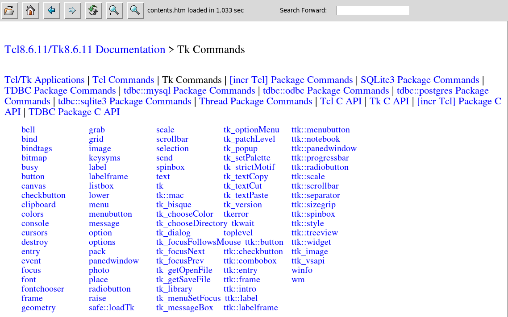

## thtmlview

### Description

The `thtmlview` package provides a pure Tcl/Tk widget to display basic HTML and
Markdown files. An installation of the Tcllib package *snit* is required. To
display Markdown files the Tcllib *Markdown* package has to be installed as
well. The package *TkImg* is required to support the display of JPEG images.

This widget is not a web browser. It will not work with http(s) addresses and
only relative filenames for images and links should be used. The widget supports
base64 encoded images embedded directly into HTML pages.

* [Manual](http://htmlpreview.github.io/?https://github.com/mittelmark/thtmlview/blob/master/thtmlview/thtmlview.html)

Background: _thtmlview_ It is a fork of my other widget _shtmlview_ which you find on [https://github.com/tcltk/tklib](https://github.com/tcltk/tklib).
I would like to place the changes from _thtmlview_ to _shtmlview_, but as I do not use fossil the usual fork and merge approaches will not work. 
So I decided to rename my widgets from _shtmlview_ to _thtmlview_ to make it distinguishable
from the tcllib widget. Sorry for this fork, but I really need to use and extend the widget
for my purposes in my own software which might be not the way tklib is supporting.


### Standalone Application

The file `thtmlview.tcl` is not only a Tcl package but also a standalone
application for the direct viewing of Markdown and HTML files.

To display a HTML file invoke it as

```
tclsh thtmlview.tcl filename.html
```

The image below is a screen shot from when the standalone application was used
to browse the Tcl/Tk core documentation:



Invoke `tclsh thtmlview.tcl --help` in your terminal to see the embedded
documentation explaining more options.

### See also

* [Wikipage on Tclers Wiki](https://wiki.tcl-lang.org/page/thtmlview)
* [tkhtml(1)](https://github.com/wjoye/tkhtml1)
* [tkhtml3](http://tkhtml.tcl.tk/index.html)

### TODO's

* [x] svg file and inline data support using svgconvert [https://github.com/mittelmark/svgconvert/](https://github.com/mittelmark/svgconvert/) !
* [x] more investigations into the existing css functionality, keept it or throw it a away  (thrown away, we should keep it minimal)
* [x] removal of forms part (thrown away - no chance to implement a web browser)
* [x] edit/view mode using Ctrl-Shift-e to switch between view and edit mode to directly edit and save for instance a Markdown document
* [ ] help megawidget with TOC and index search such as dgHelpBrowser (new megawidget)
